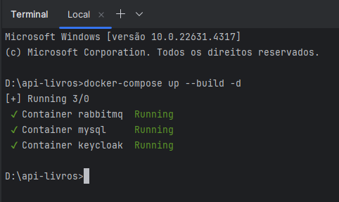
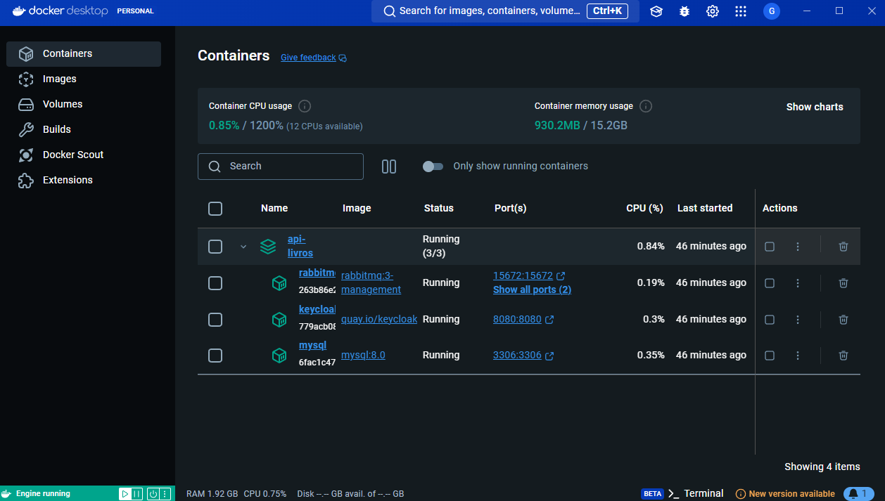
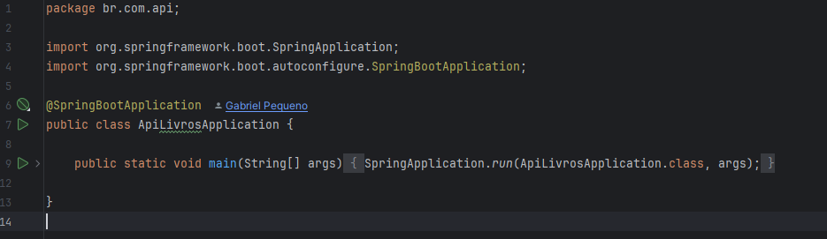
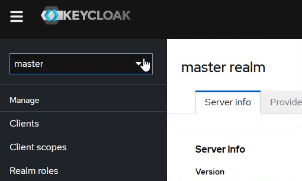
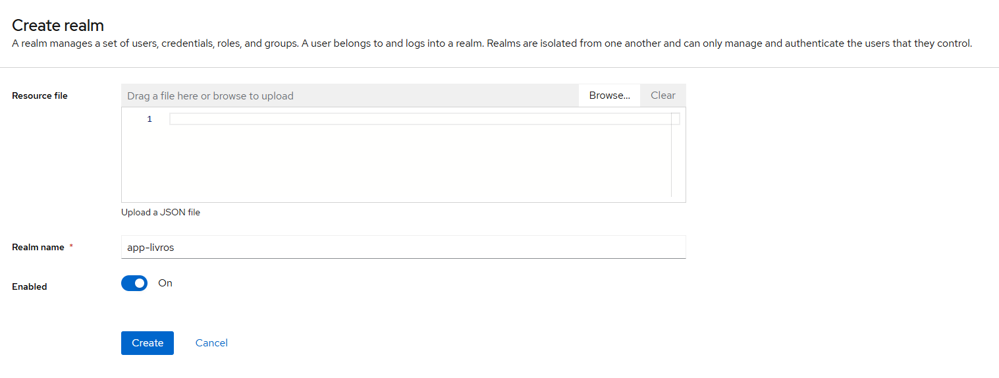
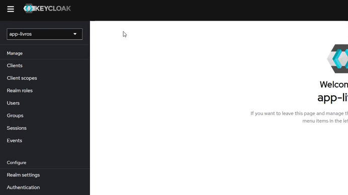
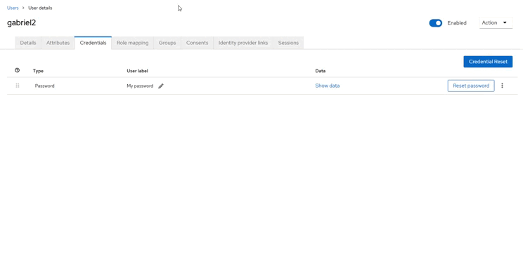
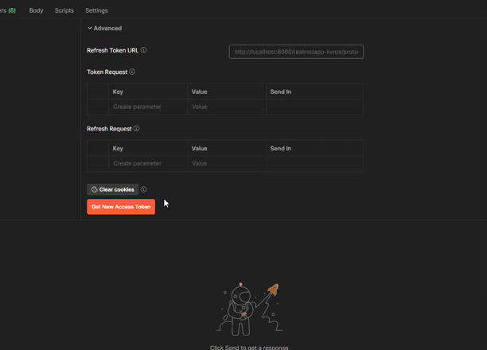
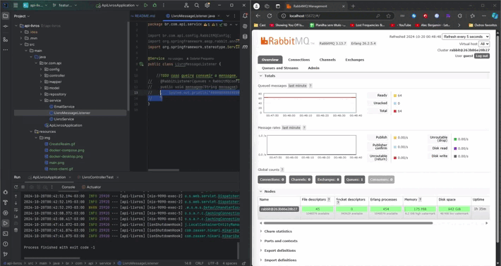

# API aluguel de livros

Este projeto é uma API REST para alugeis de livros. Ele permite o CRUD de livros, 
a alteração de sua situação quando o livro é alugado e a consulta de livros cadastrados.

## Funcionalidades
- **Cadastrar um livro**.
- **Atualizar um livro**.
- **Alterar um livro**.
- **Consultar um livro**.
- **Consultar um livro por ID**.
- **Alugar um livro**.
- **Devolver um livro**.

## Tecnologias utilizadas

- **Linguagem**: Java 17.
- **Framework**: Spring Boot.
- **Banco de Dados**: H2 e MySql (KeyCloak).
- **Containerização**: Docker.
- **Orquestração**: Docker Compose.
- **Gerenciamento de Usuários e autenticação com JWT**: KeyCloak, Spring Security, OAuth 2
- **Mensageria**: RabbitMQ.

### Entidade: Livro

A tabela de contas contém os seguintes campos:

- `id`: Identificador único.
- `titulo`: Título do livro.
- `autor`: Nome do autor do livro.
- `isbn`: Código ISBN do livro.
- `disponivel`: Indica se o livro está disponível para empréstimo.
- `uuidUsuarioKeycloak`: UUID do usuário no Keycloak que registrou o livro..

## Configuração e Execução

### Pré-requisitos

- Docker (Desktop)
- Java 17+
- Intelij (Ou uma IDE de sua preferência)
- Postman (para realizar requisições)

### Passos para Executar o Projeto

1. **Clone o repositório**

   ```bash
   git clone https://github.com/galzit0/api-livros.git
   ```

2. **Configuração do ambiente**

- Docker Compose: No arquivo docker-compose.yml executar o arquivo de configuração para a montagem das imagens/containers 
que serão resposaveis por subir o keycloak, o banco do keycloak e o RabbitMQ, basta rodar o comando abaixo e aguardar o container subir.

   ```bash
   docker-compose up --build -d
   ```

   

   

3. **Subindo a aplicação Java**

Para subir a aplicação, basta executar a classe Main (ApiLivrosApplication):



Com os aplicações em pé, iremos configurar o keycloak:

1. **Acessando e configurando o keycloak**

- No seu navegador, acesse KeyCloak disponível no link http://localhost:8080/ e clique no "Administration Console" para ser redirecionado a 
tela de login do keycloak.
- Na tela de login utilize as credenciais Username: admin e Password: admin.
- Agora vamos criar um novo Realm, no canto superior direito clique em "Create Realm".



- Na nova tela que irá surgir dê o nome do Realm de
"app-livros" pois a aplicação Java já está pré configurada para esse Realm.



- Clique em Create.
- Com o Realm Criado, selecione o Realm app-livros no canto superior esquerdo e clique em "Clients" e logo em seguida "Create client"




- Em "Client ID" informe "api-livros" pois a api-está pré configurada e precisa desses parâmetros, clique em "Next" e "Save".
- Com o Client criado, vamos criar as Roles desse Client, na aba da esquerda selecione "Clients" e em seguida 
escolha o que acabamos de criar "api-livros".
- Na sessão "Roles" crie uma nova role com o nome de "Administrador".
- Depois de criar o Role, vamos criar um usuário para esse Realm, na side bar a esquerda, clique em "Users", "Add User",
Preencha os campos "Username", "Email", "First name", "Last name" e clique em Create.
- Agora vamos definir uma senha para esse Usuário, clique em "Credentials" e logo em seguida em "Set password", 
informe sua senha, confirme ela e desmarque a opção "Temporary" e salve.
- Com a senha criada, iremos atribuir a Role de Administrador a esse usuário. Clique em "Role mapping", logo em sequida 
em "Assign Role" no filtro a esquerda, selecione o filtro "Filter by clients" e selecione a Role de Administrador que está 
vinculada ao Realm "app-livros", logo em seguida clique em "Assign".


  
- Com o KeyCloak e usuários configurados, podemos prosseguir para a proxima etapa.


2. **Realizando Requisições via Postman**

- No postman, iremos realizar uma pequena configuração, clique na aba Authorization e selecione o tipo de autorização "OAuth 2.0".
- Preencha os campos
   - **Access Token URL**: http://localhost:8080/realms/app-livros/protocol/openid-connect/token.
   - **Client ID**: app-livros
   - **Username**: Informe o seu usuário cadastrado no keycloak
   - **Password**: Informe a sua senha cadastrado no keycloak
- Logo em seguida clique em "Get New Access Token" e "Use Token"



- Com a configuração finalizada, agora é só realizar as requisições!
    - **Path**: http://localhost:9090/api-livros/
  
3. **RabbitMQ**

- Para acessar o RabbitMQ basta acessar o link http://localhost:15672/#/ informar o Username: **guest** e o Password: **guest**.
- O Serviço que consome as mensagens está comentado, caso queira consumir todas as mensagens enviadas basta remover o comentário. 
Quanto ao serviço de e-mail foi feito só a logica pois precisa ser configurado um e-mail válido! Basta informar 
o seu, disponibilizar a configuração no seu proprio email e remover o comentário da chaamda de envio de e-mail.

